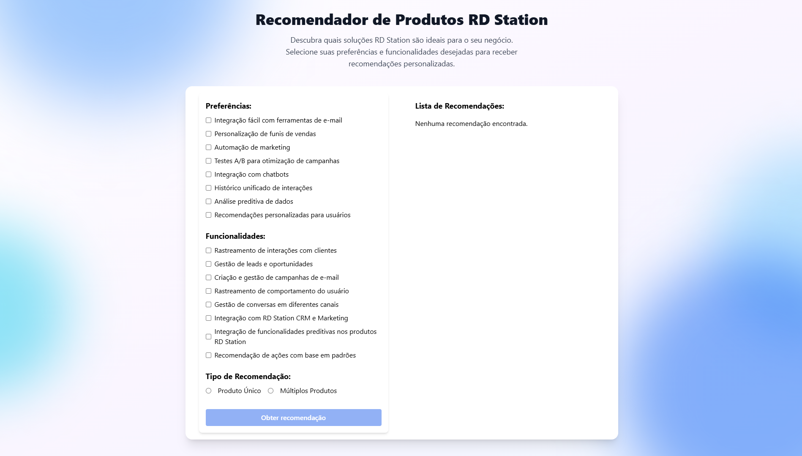
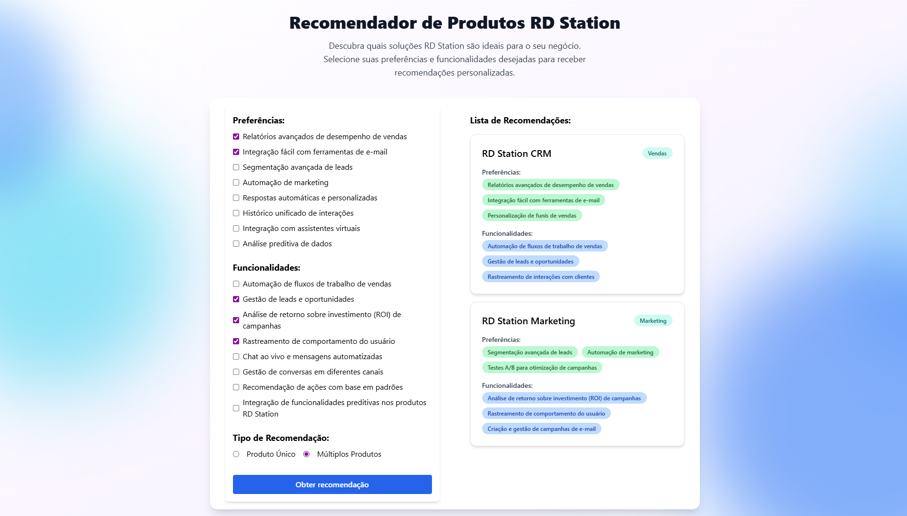

<h1 align="center">
  Recomendador de Produtos - RD Station 💡
</h1>

<p align="center">
  <a href="#-screenshots">Capturas de Tela</a>&nbsp;&nbsp;&nbsp;|&nbsp;&nbsp;&nbsp;
  <a href="#-sobre">Sobre</a>&nbsp;&nbsp;&nbsp;|&nbsp;&nbsp;&nbsp;
  <a href="#-projeto">Projeto</a>&nbsp;&nbsp;&nbsp;|&nbsp;&nbsp;&nbsp;
  <a href="#-tecnologias">Tecnologias</a>&nbsp;&nbsp;&nbsp;|&nbsp;&nbsp;&nbsp;
    <a href="#-como-executar">Como Executar</a>&nbsp;&nbsp;&nbsp;|&nbsp;&nbsp;&nbsp;
  <a href="#-testes">Testes</a>
</p>

## 📷 Capturas de Tela

### Formulário do Recomendador de Produtos

<p align="center">
  
</p>

### Lista de Recomendações

<p align="center">
  
</p>

## 🧠 Sobre

O **Recomendador de Produtos RD Station** é uma aplicação desenvolvida como parte de um **teste técnico para a vaga de Desenvolvedor Front-end na RD Station**.

O objetivo do projeto é implementar a **lógica de recomendação de produtos RD Station** baseada em preferências e funcionalidades escolhidas pelo usuário, simulando um caso real de personalização de soluções.

## 🚀 Projeto

🌟 **Situação**:  
O desafio propôs criar uma lógica de recomendação para diferentes produtos RD Station (como CRM e Marketing), permitindo ao usuário selecionar preferências e funcionalidades e visualizar recomendações personalizadas.

🎯 **Tarefa**:

- Implementar a lógica de recomendação de produtos.
- Atualizar a lista de recomendações em tempo real conforme o usuário altera as preferências.
- Integrar o front-end (React + Tailwind) com o backend simulado via **json-server**.

🚀 **Ação**:

- Implementada a lógica para atualizar recomendações sempre que o formulário sofre alterações.
- Criada a integração entre preferências/funcionalidades do usuário e o serviço de recomendação.
- Desenvolvida a lógica de negócios que compara entradas do usuário com os dados de produtos e retorna os mais adequados.

🏆 **Resultado**:

- ✅ Recomendação personalizada de produtos RD Station.
- ✅ Integração com **json-server** para simulação de API RESTful.
- ✅ Layout responsivo utilizando Tailwind CSS.
- ✅ Código modular e extensível para futuras melhorias.

## 🛠️ Tecnologias

- [React.js](https://reactjs.org/)
- [JavaScript](https://developer.mozilla.org/pt-BR/docs/Web/JavaScript)
- [Json Server](https://github.com/typicode/json-server)
- [Tailwind CSS](https://tailwindcss.com/)

## 💡 Decisões Técnicas

- **Tailwind CSS** para estilização rápida e responsiva.
- **Json Server** para simulação de backend RESTful.
- **Arquitetura modular** separando lógica de recomendação em um service independente.
- **React Hooks** para controle de estado e reatividade da interface.

## ⚡ Como Executar

Antes de começar, garanta que você tenha [Git](https://git-scm.com) e [Node.js v18.3+](https://nodejs.org/) instalados na sua máquina.

```sh
# Clone este repositório:
$ git clone https://github.com/marcelopajr/rd-station-frontend-challenge

# Entre no diretório do projeto:
$ cd rd-station-frontend-challenge

# Instale as dependências:
$ yarn install

# Para instalar o projeto, execute o script
$ ./install.sh

# Inicie o backend:
$ yarn start:backend

# Inicie o frontend:
$ yarn start:frontend

# Ou rode ambos simultaneamente:
$ yarn start
```

## 🧪 Testes

O projeto possui uma suíte de testes automatizados para garantir a qualidade da lógica de recomendação e da interface.

### Como rodar os testes

No diretório `frontend`, execute:

```sh
yarn test
```

### O que é testado?

- **Lógica de recomendação:** Garante que os produtos recomendados estejam corretos de acordo com as preferências e funcionalidades selecionadas.
- **Lógica do botão de envio:** Verifica se o botão de envio está habilitado ou desabilitado conforme as regras de preenchimento do formulário.

### Exemplo de saída dos testes

```
PASS  src/services/recommendation.service.test.js
  Lógica de recomendação
    ✓ Retorna recomendação correta para SingleProduct com base nas preferências selecionadas
    ✓ Retorna recomendações corretas para MultipleProducts com base nas preferências selecionadas
    ✓ Retorna apenas um produto para SingleProduct com mais de um produto de match
    ✓ Retorna o último match em caso de empate para SingleProduct
  Lógica de desabilitação do botão de envio
    ✓ Botão desabilitado se nenhuma preferência e nenhuma funcionalidade forem selecionadas
    ✓ Botão desabilitado se nenhum tipo de recomendação for selecionado
    ✓ Botão desabilitado se preferências for undefined e features vazio
    ✓ Botão desabilitado se features for undefined e preferências vazio
    ✓ Botão habilitado se pelo menos uma preferência for selecionada
    ✓ Botão habilitado se pelo menos uma funcionalidade for selecionada
    ✓ Botão habilitado se ambos preferência e feature forem selecionadas

Test Suites: 1 passed, 1 total
Tests:       11 passed, 11 total
```
